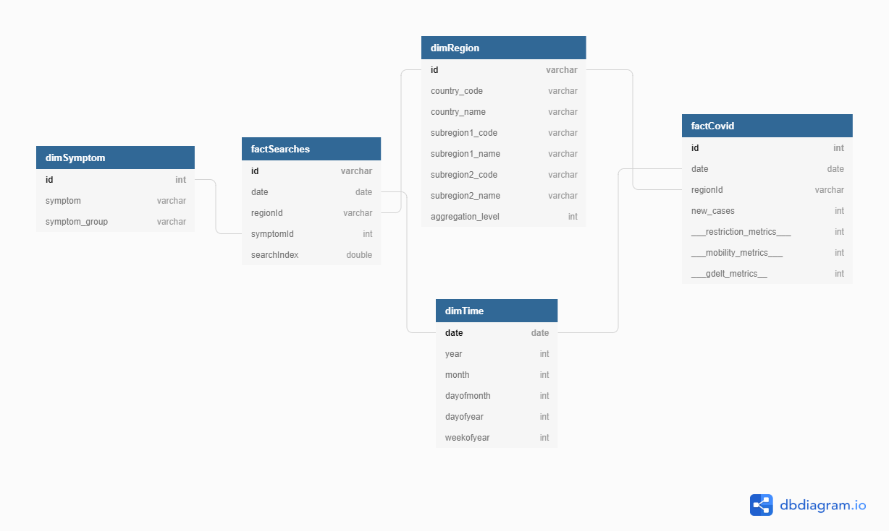

# Covid-19 Capstone Project

2020 brought the Corona-Virus to the world and as sad and dramatic as the pandemic is there is also a lot of public data available. This project uses some of this data to help to analyze the pandemic and its consequences in detail.

This document describes the project in detail.

For a technical setup to run to provided python scripts or notebooks see [Setup](Setup.md).

## Goal of the Project

The goal of this project is to gather and analyze data of the Corona-Virus pandemic. The project focuses on the dynamic of the pandemic and the response to it of the people and the public.

Here are some sample questions this project is trying to answer:

* Where did the pandemic start and how fast were the governments reacting?
* How detailed was the media coverage and how did it develop?
* Which effects did the pandemic have on mobility?
* Which behavioural changes concerning internet search did the pandemic have at what time?
* How did government policies impact the covid cases and vice versa?

## Scope of the Project and used Datasets

The project uses three different data sources and five datasets to build a data lake and/or a data warehouse for analytical purposes.

The data sources and datasets are the following:

* The COVID-19 Open-Data on the Google Cloud Platform
* The Global Database of Events, Language, and Tone - GDELT
* The Oxford Covid-19 Government Response Tracker

### The COVID-19 Open-Data on the Google Cloud Platform

"This repository contains datasets of daily time-series data related to COVID-19 for over 20,000 distinct locations around the world. The data is at the spatial resolution of states/provinces for most regions and at county/municipality resolution for many countries..." [1]

"The data is drawn from multiple sources [...] and stored in separate tables as CSV files grouped by context, which can be easily merged due to the use of consistent geographic (and temporal) keys as it is done for the main table." [2]

Although the Google Cloud Platform offers many datasets we will only used three datasets, because we are mainly interested in the response of the people and the public to the pandemic:

* The Epidemiology Dataset - contains data about the Covid-19 cases
* The Mobility Dataset - contains indicators representing the mobility of people in different areas
* The Google Search Trends Dataset - contains search indicators for more than 400 disease symptoms

The data and the documention of the COVID-19 Open-Data can be found here: https://github.com/GoogleCloudPlatform/covid-19-open-data/blob/main/README.md

### The Global Database of Events, Language, and Tone - GDELT

"[...] the GDELT Project monitors the world's broadcast, print, and web news from nearly every corner of every country in over 100 languages and identifies the people, locations, organizations, themes, sources, emotions, counts, quotes, images and events driving our global society every second of every day, creating a free open platform for computing on the entire world." [3]

For this project data of the GDELT 1.0 Event Database is used. See: https://www.gdeltproject.org/data.html

The data is very massive, containing hundreds of thousands of records for every day. To download an example batch of the data go to: http://data.gdeltproject.org/events/index.html

### The Oxford Covid-19 Government Response Tracker

"The Oxford Covid-19 Government Response Tracker (OxCGRT) collects systematic information on which governments have taken which measures, and when. This can help decision-makers and citizens understand governmental responses in a consistent way, aiding efforts to fight the pandemic. The OxCGRT systematically collects information on several different common policy responses governments have taken, records these policies on a scale to reflect the extent of government action, and aggregates these scores into a suite of policy indices." [4]

For more details see: https://github.com/OxCGRT/covid-policy-tracker

The data can be found here: https://github.com/OxCGRT/covid-policy-tracker/blob/master/data/OxCGRT_latest.csv

## Assessment of the datasets

The assessment of the datasets was done with Apache Spark on AWS EMR. On top of EMR the Jupyter Lab feature was used.

For details see the Jupyter Notebook in the Folder [Assessment](/assessment)

### Summary of the Assessments

#### The Epidemiology dataset 
* contains almost 4 million records and 10 features
* for the time between 2019-10-23 and 2020-12-16
* some columns needed to be converted to the right datatype

#### The Mobility dataset
* contains more than 2 million records and 8 features
* for the time between 2020-02-15 and 2020-12-11
* some columns needed to be converted to the right datatype

#### The Search Trends dataset
* contains almost 1 million records and more than 400 features
* for the time between 2020-01-01 and 2020-12-13
* the large amount of columns is caused by many search trends whose search index is represented in columns

#### The GDELT dataset
* contains more than 130.000 records. Only for the day of 2020-12-15.
* many interesting and specific features like Actors, Events und Actions
* Country Codes represented in the FIPS encoding

#### The Oxford Covid-19 dataset
* round about 100.000 records
* for the time between 2020-01-01 and 2020-12-21
* nearly 50 features, most of them ordinal metrics

## Data and Processing Architecture

This paragraph describes the architecture of the developed solution and its status quo.

### Ingestion

The ingestion of the data in the first implemented step is simple. The data was downloaded from the different sources and uploaded to an AWS S3 bucket.

Because the amount of the gdelt data is huge, there is only one file for one single day that was downloaded and moved to S3.

The data is not updated in the first place. The current solution has only static data.

### Structure of the data lake

The data on AWS S3 is structured in three stages for different purposes.

#### Stage 0: raw data

This stages is used for ingestion of the data and to store a copy of it on S3. The data in this stage will not be manipulated in any kind and is saved in the original form.

The data of this stage can be used for very deep analytical purposes that needs original data that maybe was left aside in stage 1.

#### Stage 1: preprocessed, cleaned and normalized data

This stage represents data that is preprocessed and cleaned. The datasets are not joined yet, but the data types of the selected columns are correct and the data is consistent. Some normalizations have been applied, for example the country codes are all converted to the same ISO format.

The data of this stage is useful for direct analytical purposes that do not need the join of the dataset or will handle it separately.

The data is stored in form of parquet files and partitioned by country to make the analysis of single countries easier.

#### Stage 2: joined data and represented in the data model

This stage represents the analytical warehouse in a data lake format. All datasets are joined where possible, cleaned and transformed and are ready to be queried.

The data is stored in form of parquet files and partitioned by country to make the analysis of single countries easier.

#### The Data Model of Stage 2 data

The data model of the data store in stage 2 is shown below. 

The model consists of two main dimensions: dimRegion and dimTime. The first contains hierarchical spatial data and is leaned on the index file provided in the google data. The time dimensions represents single days from October 2020 to now.

A third dimension is specific for the google search trends data: dimSymptom. This dimension contains the symptoms that are provided as features in the search trend data. For dynamic analysis it is better to store them in a dimension instead of features. Also this saves a lot of disk space and makes the data model a lot more readable.

Finally there are two fact tables: factCovid and factSearches. FactCovid is the main fact table representing most of the metrics while factSearches represents mainly the search index of disease symptoms. It was a design decision to not combine those two fact tables.

The design of the data model is following the galaxy schema approach. This is necessary because the type of observations are very different. For some metrics it is a day-spatial based observation, for the search trends it is day-spatial-symptom based.

**Note**: the metrics of the fact table factCovid are indicated with a placeholder to keep the figure of the data model simple.

#### Data Dictionary for Stage 2 data

For more details see the [data dictionary](DataDictionary.md) for stage 2 data. 

### Data Processing

The data processing is done by using Spark on AWS Elastic Map Reduce (EMR). The data lake, as mentioned before, is represented on AWS S3 in form of parquet files. This tech stack is very lightweight and efficient and is also able to handle huge amounts of data.

The ETL-Process is written in Python using PySpark. The ETL is divided in two steps: etl stage 1 is transforming the data to the stage 1 of the data lake and etl stage 2 reads this data and creates the stage 2 output files.

Both ETL-Processes perform data quality checks and terminate the process if the checks fail.

#### ETL Stage 1

See [etl_stage2.py](/etl/etl_stage1.py) for details.

This ETL reads in the raw data of stage 0 and cleans the datasets. The data is not joined yet, but type conversions are made. The datasets are reduced to the necessary columns and stored as parquet files, partitioned by country.

#### ETL Stage 2

See [etl_stage2.py](/etl/etl_stage2.py) for details.

This ETL reads in the preprocessed data of stage 1, joins the data by date and region. The process maps the data to the data model and writes each table of the data model back to S3. The data is stored as parquet files, partitioned by country.

### Analytical components

Finally the analytical components that will use the data lake can be build in different ways. In general every application that can handle and query parquet files on S3 is imaginable and it depends on the final needs which solution is the best.

Possible solutions are:

* Jupyter Notebooks using PySpark on AWS EMR. This solution is good for very analytical purposes and users that are capable of using PySpark.
* Redshift Spectrum, which allows to query S3 data with SQL using any Redshift client. AWS recommends to store the dimension tables as redshift tables and leave the huge fact tables in S3. Spectrum allows the user to combine this two data formats in one query. [5]
* AWS Athena to query the S3 data directly and serverless.

To create dashboards and visualizations the possibilities are also numerous. AWS offers QuickSight which could be used for example on top of Redshift Spectrum. In the end this is also a decision of the projects budgets. A very cost efficient solution would be to build a open source dashboard using technologies like Plotly and host them on AWS.

## Outlook and next steps

This project did not come to its end yet. There are several more steps to be taken. The biggest possible improvements are in the field of ingestion and automation of the data processing. Also an analytical component is to be build. In details this means:

* Ingest the google covid open data datasets directly from the Google Cloud Platform via a call of the bigquery api.
* Automate the ingestion of gdelt and oxford data with iterating and scripted downloads of the available datasets.
* Automate the api calls and etl-processes with Airflow. Use the managed Airflow service of AWS MWAA. [6]
* Process daily updates and backfill data with the huge amount of gdelt data using Airflow.
* Build an analytical applicaton and/or dashboard. If necessary create data marts for better query performances in S3 or Redshift.

### Update cycle of the data

The update cycle of the data should be set to daily. The publisher of the datasets released them also in a daily interval.

### Scalability

The described solution is very scalable. The amount of storage on S3 is unlimited. Spark can handle lots of data, if there is an performance issue, the EMR cluster could be scaled or the data can be processed in partitions (e.g. by day and country). If the final queries in the analytical components would run into performance issues, specific data marts for given analytical tasks could be created to solve those issues.

[1]: https://github.com/GoogleCloudPlatform/covid-19-open-data/blob/main/README.md
[2]: https://github.com/GoogleCloudPlatform/covid-19-open-data/blob/main/README.md
[3]: https://www.gdeltproject.org/
[4]: https://github.com/OxCGRT/covid-policy-tracker
[5]: https://docs.aws.amazon.com/redshift/latest/dg/c-spectrum-external-schemas.html
[6]: https://aws.amazon.com/de/managed-workflows-for-apache-airflow/